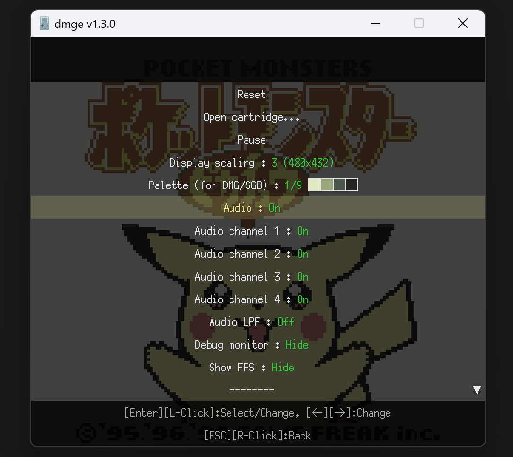

# dmge - DMG Emulator

https://github.com/voidproc/dmge

C++ / OpenSiv3D でゲームボーイのエミュレータを作っています。

## 目次

- [dmge - DMG Emulator](#dmge---dmg-emulator)
  - [目次](#目次)
  - [概要](#概要)
  - [開発環境](#開発環境)
  - [ダウンロード](#ダウンロード)
  - [使用方法](#使用方法)
    - [アプリケーションの起動](#アプリケーションの起動)
    - [メニュー](#メニュー)
    - [キーボードショートカット](#キーボードショートカット)
    - [設定（`config.ini`）](#設定configini)
  - [実装状況](#実装状況)
  - [スクリーンショット](#スクリーンショット)
  - [テスト ROM 実行結果](#テスト-rom-実行結果)

## 概要

C++ / OpenSiv3D でゲームボーイのエミュレータを作っています。ゲームボーイの構造や動作原理、そしてエミュレータの開発に関する理解を深めるための、主に学習目的のプロジェクトです。

正確性や効率性、ユーザーインターフェースに関することの優先度は低く、特筆すべき機能もありません。そのため、何かのカートリッジイメージを動作させることが目的であれば、[BGB](https://bgb.bircd.org/) や [SameBoy](https://sameboy.github.io/) のような優れたエミュレータの使用をおすすめします。

## 開発環境

- Windows 11
- Visual Studio 2022
- [OpenSiv3D](https://github.com/Siv3D/OpenSiv3D) v0.6.11
- [OpenSiv3D for Web](https://siv3d.kamenokosoft.com/docs/ja/) v0.6.6

## ダウンロード

- [Releases - v1.4.2](https://github.com/voidproc/dmge/releases/download/v1.4.2/dmge_v1.4.2.zip)

## 使用方法

### Windows 版

`dmge.exe` を起動してください。

### Web 版

https://voidproc.github.io/dmge_web/

※ Web 版では、設定の保存／読み込みやセーブデータの保存／読み込みができないなどの制限があります

### メニュー

右クリック、<kbd>Escape</kbd> キー、または左クリック長押しでメニューが表示されます。次に示す各種操作や設定変更を行うことができます。

- リセット
- カートリッジを開く（ダイアログ表示）
- ポーズ（ステップ実行開始）
- 画面サイズ変更（x1 ～ x8）
- パレットカラーのプリセットを切替（DMG/SGB モード）
- コントローラ設定（キーボード／ゲームパッドのボタン割り当て）
- オーディオ有効／無効切替
- オーディオチャンネル 1～4 のミュート切替
- オーディオの LPF 有効／無効切替
- デバッグモニタ表示切替
- FPS 表示切替

メニューはキーボードまたはマウスで操作できます。

- 選択: <kbd>&uarr;</kbd>、<kbd>&darr;</kbd>、<kbd>マウスホイール</kbd>
- 決定／値の変更: <kbd>Enter</kbd>、<kbd>左クリック</kbd>
- 値の変更（増減）: <kbd>&larr;</kbd>、<kbd>&rarr;</kbd>
- 戻る: <kbd>Escape</kbd>、<kbd>右クリック</kbd>

### キーボードショートカット

以下のキーボードショートカットが使用できます。

- ボタン操作（カスタマイズ可能）
  - 4方向ボタン : <kbd>&uarr;</kbd> <kbd>&darr;</kbd> <kbd>&larr;</kbd> <kbd>&rarr;</kbd>
  - A ボタン : <kbd>X</kbd>
  - B ボタン : <kbd>Z</kbd>
  - Start ボタン : <kbd>Enter</kbd>
  - Select ボタン : <kbd>BackSpace</kbd>
- ファイル
  - カートリッジを開くダイアログ表示 : <kbd>Ctrl + O</kbd>
  - リセット : <kbd>Ctrl + R</kbd>
- レンダリング
  - パレットカラーのプリセットを切替（DMG/SGB モード） : <kbd>Ctrl + L</kbd>
- オーディオ
  - チャンネル 1 のミュートを切替 : <kbd>1</kbd>
  - チャンネル 2 のミュートを切替 : <kbd>2</kbd>
  - チャンネル 3 のミュートを切替 : <kbd>3</kbd>
  - チャンネル 4 のミュートを切替 : <kbd>4</kbd>
  - オーディオ有効／無効切替 : <kbd>5</kbd>
  - オーディオの LPF 有効／無効切替 : <kbd>6</kbd>
- デバッグ
  - デバッグモニタ表示切替 : <kbd>F10</kbd>
  - デバッグモニタのメモリダンプ対象アドレス設定 : <kbd>Ctrl + M</kbd>
  - ステップ実行を開始／終了 : <kbd>Ctrl + P</kbd>
  - ステップ実行 : <kbd>F7</kbd>
  - ステップ実行を終了 : <kbd>F5</kbd>
  - コンソールへ常に実行結果をダンプする : <kbd>Ctrl + D</kbd>

### 設定（`config.ini`）

各種設定は起動時に `config.ini` から読み込まれ、アプリケーション終了時に**上書き保存されます** 。

設定変更は上記のメニューから行うことができます。または `config.ini` ファイルを直接編集することも可能です。

設定項目は次のとおりです（[`config.example.ini`](https://github.com/voidproc/dmge/blob/main/dmge/App/config.example.ini) を参考にしてください）。

- カートリッジ関連
  - `CartridgePath` : 読み込むカートリッジファイルのパス
  - `OpenCartridgeDirectory` : カートリッジを開くダイアログのデフォルトディレクトリ
  - `DetectCGB` : カートリッジが対応していれば CGB モードで実行する（1=有効、0=無効）
  - `DetectSGB` : カートリッジが対応していれば SGB モードで実行する（1=有効、0=無効）
  - `BootROM` : Bootstrap ROM のパス
- 画面表示関連
  - `Scale` : 画面の表示倍率
  - `ShowFPS` : 画面上部にFPSを表示する（1=有効、0=無効）
  - `PalettePreset` : パレットカラーのプリセット番号（0～8、0番はカスタムカラー） (DMG/SGB)
  - `PaletteColor0` ～ `PaletteColor3` : カスタムカラー (DMG/SGB)
  - `CGBColorGamma` : CGB モードでのカラー補正（ガンマ値）
- デバッグモニタ関連
  - `ShowDebugMonitor` : デバッグモニタを表示する（1=有効、0=無効）
- 入力関連
  - `Keyboard****` : キーボードの割り当て
    - `KeyboardRight`, `KeyboardLeft`, `KeyboardUp`, `KeyboardDown`, `KeyboardA`, `KeyboardB`, `KeyboardSelect`, `KeyboardStart`
  - `GamepadButton****` : ゲームパッドのボタン割り当て
    - `GamepadButtonA`, `GamepadButtonB`, `GamepadButtonSelect`, `GamepadButtonStart`
- オーディオ関連
  - `EnableAudioLPF` : オーディオにローパスフィルタを適用する（1=有効、0=無効）
  - `AudioLPFConstant` : ローパスフィルタの定数（0～1）
- デバッグ関連
  - `ShowConsole` : コンソールを表示する（1=有効、0=無効）
  - `Breakpoint` : ブレークポイント（コンマ区切りで複数指定可能）
  - `MemoryWriteBreakpoint` : メモリ書き込み時ブレークポイント（コンマ区切りで複数指定可能）
  - `BreakOnLDBB` : LD B,B 実行時にブレークする（1=有効、0=無効）
  - `EnableBreakpoint` : 上記ブレークポイントの有効／無効の切替（1=有効、0=無効）
  - `DumpAddress` : ブレーク時のメモリダンプ先アドレス（コンマ区切りで複数指定可能）
  - `TraceDumpStartAddress` : トレースダンプを開始するアドレス（コンマ区切りで複数指定可能）
  - `LogFilePath` : トレースダンプなどの出力先のパス
  - `TestMode` : テスト ROM 実行モード（1=有効、0=無効）

## 実装状況

- CPU
  - [x] 一般的な命令の実装
  - [x] テスト ROM (cpu_instrs / instr_timing) による検証
  - [ ] STOP
    - [x] 倍速モード (CGB) の切り替え
    - [ ] STOP 状態の遷移
- MBC
  - [x] ROM Only
  - [x] MBC1 (マルチカートを除く)
  - [x] MBC2
  - [x] MBC3
    - [x] RTC
    - [x] MBC30
  - [x] MBC5 (Rumble を除く)
  - [x] HuC1 (赤外線通信を除く)
  - [ ] その他
- PPU
  - [x] DMG
  - [x] CGB
  - [x] テスト ROM (dmg-acid2 / cgb-acid2) による検証
- APU
  - [x] ひととおりの機能の実装
  - [ ] テスト ROM (dmg_sound) による検証
- Joypad
  - [x] キーボードによる操作
  - [x] ゲームパッドによる操作
- シリアル通信
  - [x] 相手がいない場合の内部クロック通信・割り込み
  - [ ] それ以外
- その他
  - [ ] SGB
    - [x] 一部の SGB コマンドに対応
      - `PAL` 系（`PAL_PRI` を除く）
      - `ATTR_***`
      - `MASK_EN`, `MLT_REQ`
    - [x] カラー表示
    - [ ] ボーダー
  - [ ] Bootstrap ROM の読み込み
    - [x] DMG
    - [ ] CGB
  - [ ] Joypad 割り込み
  - [x] 倍速モード (CGB) 
  - [ ] その他

## スクリーンショット

[View more...](screenshot.md)

## テスト ROM 実行結果

|Test|Result|
|---|---|
|✅ blarg/​cpu_instrs||
|✅ blarg/instr_timing||
|✅ blarg/interrupt_time||
|❌ blarg/dmg_sound|Failed: 03#3, 05#4, 07#5, 09, 10, 12 |
|✅ acid/dmg-acid2||
|✅ acid/cgb-acid2||
|✅ ax6/​rtc3test-1||
|✅ ax6/​rtc3test-2||
|✅ ax6/​rtc3test-3||
|✅ mooneye/​acceptance/​timer|Pass|
|✅ mooneye/manual-only/sprite_priority||
