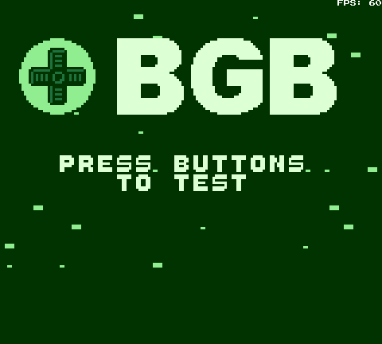

# dmge - DMG Emulator

C++ / OpenSiv3D でゲームボーイのエミュレータを作っています。

## 開発環境

- Windows 11
- Visual Studio 2022
- [OpenSiv3D](https://github.com/Siv3D/OpenSiv3D) v0.6.9

## スクリーンショット

hello-world.gb

cpu_instrs.gb

dmg-acid2.gb

bgbtest.gb

