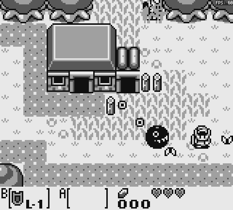

# dmge - DMG Emulator

C++ / OpenSiv3D でゲームボーイのエミュレータを作っています。

## 概要

ゲームボーイの構造や動作原理、そしてエミュレータの開発に関する理解を深めるための、主に学習目的のプロジェクトです。正確性や効率性、ユーザーインターフェースに関することの優先度は低く、特筆すべき機能もありません。そのため、何かのカートリッジイメージを動作させることが目的であれば、[BGB](https://bgb.bircd.org/) や [SameBoy](https://sameboy.github.io/) のような優れたエミュレータの使用をおすすめします。とはいえ、ある程度の機能を実装した後に、実行可能ファイル（Windows のみ）の公開を予定しています。

## 開発環境

- Windows 11
- Visual Studio 2022
- [OpenSiv3D](https://github.com/Siv3D/OpenSiv3D) v0.6.9

## [スクリーンショット](screenshot.md)

### Test ROMs

[View more...](screenshot.md)
