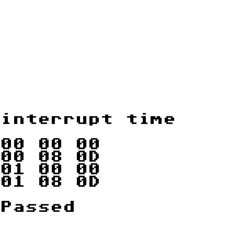
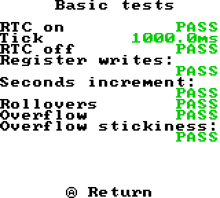

# dmge - DMG Emulator

C++ / OpenSiv3D でゲームボーイのエミュレータを作っています。

## 目次

- [dmge - DMG Emulator](#dmge---dmg-emulator)
  - [目次](#目次)
  - [概要](#概要)
  - [開発環境](#開発環境)
  - [実装状況](#実装状況)
  - [テスト ROM 実行結果](#テスト-rom-実行結果)
  - [スクリーンショット](#スクリーンショット)

## 概要

C++ / OpenSiv3D でゲームボーイのエミュレータを作っています。ゲームボーイの構造や動作原理、そしてエミュレータの開発に関する理解を深めるための、主に学習目的のプロジェクトです。

正確性や効率性、ユーザーインターフェースに関することの優先度は低く、特筆すべき機能もありません。そのため、何かのカートリッジイメージを動作させることが目的であれば、[BGB](https://bgb.bircd.org/) や [SameBoy](https://sameboy.github.io/) のような優れたエミュレータの使用をおすすめします。とはいえ、ある程度の機能を実装した後に、実行可能ファイル（Windows のみ）の公開を予定しています。

## 開発環境

- Windows 11
- Visual Studio 2022
- [OpenSiv3D](https://github.com/Siv3D/OpenSiv3D) v0.6.10

## 実装状況

- CPU
  - [x] 一般的な命令の実装
  - [x] テスト ROM (cpu_instrs / instr_timing) による検証
  - [ ] STOP
- MBC
  - [x] ROM Only
  - [x] MBC1
  - [x] MBC2
  - [ ] MBC3
    - [x] MBC3 の RTC 以外の機能
    - [ ] RTC: セーブ & ロード未実装
  - [ ] MBC5
  - [ ] その他
- PPU
  - [x] DMG
  - [x] CGB
  - [x] テスト ROM (dmg-acid2 / cgb-acid2) による検証
- APU
  - [x] ひととおりの機能の実装
  - [ ] テスト ROM (dmg_sound) による検証
- Joypad
  - [x] キーボードによる操作
  - [ ] ゲームパッドによる操作
  - [x] Joy-Conによる操作（両手持ち）
  - [x] Proコントローラーによる操作
- その他
  - [ ] 通信関係
  - [ ] CGB の倍速モード
  - [ ] etc.

## テスト ROM 実行結果

|Test|Result|
|---|---|
|✅ blarg/​cpu_instrs||
|✅ blarg/instr_timing||
|❌ blarg/interrupt_time||
|❌ blarg/dmg_sound|Failed: 03#3, 05#4, 07#5, 09, 10, 12 |
|✅ acid/dmg-acid2||
|✅ acid/cgb-acid2||
|✅ ax6/​rtc3test-1||
|✅ ax6/​rtc3test-2||
|✅ ax6/​rtc3test-3||
|✅ mooneye/​acceptance/​timer|Pass|
|✅ mooneye/manual-only/sprite_priority||

## スクリーンショット

[View more...](screenshot.md)

